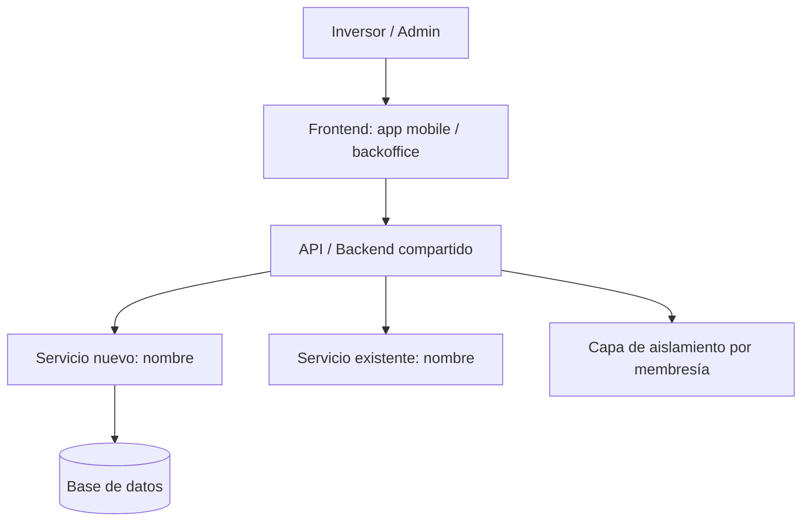

# Technical Spec — [Nombre de la Feature]

**Versión:** 1.0
**PRD relacionado:** `PRD-Spec`
**Design Spec relacionada:** `Design-Spec`
**Aplica a:** ⬜ App del inversor · ⬜ Backoffice · ⬜ Backend compartido

---

## 1. Resumen Técnico

> Una o dos oraciones sobre qué se construye y cómo encaja en el sistema existente
> (backend compartido + app mobile + backoffice desktop). El approach, sin detalle todavía.

---

## 2. Spike Técnico (si aplica)

> Solo si había incertidumbre técnica que requirió investigación previa.

**Preguntas que se investigaron:**
1.
2.

**Findings:**
- Finding 1:
- Finding 2:

**Decisión resultante:**

---

## 3. Diagrama de Arquitectura

> Incluir diagrama (Mermaid, Excalidraw o imagen). Marcar qué es nuevo vs. qué ya existe.

### Leyenda
- 🟢 Componente nuevo que se crea en este ciclo
- 🔵 Componente existente que se modifica
- ⚪ Componente existente que se usa sin cambios

### Componentes involucrados
| Componente | Estado | Descripción del cambio |
|------------|--------|------------------------|
| | nuevo / modificado / sin cambios | |

### Dependencias externas
| Servicio | Proveedor | Uso en esta feature | Doc de referencia |
|----------|-----------|--------------------|--------------------|
| | | | |

---

## 4. Modelo de Datos

> Entidades base de UMBRAL: Inversor, Desarrollo, Membresía (inversor × desarrollo),
> Solicitud de venta, Aviso. El aislamiento vive en Membresía (`UMBRAL_PRODUCTO.md` §5).
> Mantener coherencia con `software.arquitectura.modelo-datos`.

### Tablas / colecciones nuevas

#### [nombre_tabla]
| Campo | Tipo | Obligatorio | Índice | Descripción |
|-------|------|-------------|--------|-------------|
| id | UUID | sí | PK | |
| created_at | timestamp | sí | | |
| | | | | |

**Constraints:**
- [constraint o regla de integridad]

### Cambios a tablas existentes

#### [nombre_tabla_existente]
| Campo | Cambio | Tipo | Motivo |
|-------|--------|------|--------|
| | nuevo campo / nuevo índice / cambio de tipo | | |

### Estrategia de migración
- **Tipo:** online (sin downtime) / offline (con ventana de mantenimiento)
- **Script:** `migrations/[timestamp]_[nombre].sql`
- **Rollback:** cómo se revierte si falla
- **Tiempo estimado:** sobre el volumen actual

### Queries principales
| Query | Frecuencia | Plan de ejecución validado | Índices necesarios |
|-------|------------|---------------------------|-------------------|
| | alta / media / baja | sí / no | |

### Enforcement del aislamiento
> Cómo garantiza esta feature que un inversor solo accede a sus desarrollos
> (y un Admin desarrollador solo a los suyos). El front nunca decide esto solo.

- Mecanismo: <!-- ej: filtro por membresía a nivel de query / middleware de autorización -->

---

## 5. Architecture Decision Records

> Un ADR por decisión de arquitectura relevante. No documentar lo trivial.

### ADR-01 — [Título de la decisión]

**Contexto:**
Qué situación forzó la decisión.

**Decisión:**
Qué se decidió.

**Alternativas consideradas:**
| Alternativa | Por qué se descartó |
|-------------|---------------------|
| Opción A | |
| Opción B | |

**Consecuencias:**
- ✅ Lo que habilita o mejora
- ⚠️ Trade-off o deuda técnica que introduce

---

### ADR-02 — [Título de la decisión]

**Contexto:**

**Decisión:**

**Alternativas consideradas:**
| Alternativa | Por qué se descartó |
|-------------|---------------------|
| | |

**Consecuencias:**
- ✅
- ⚠️

---

## 6. Risk Register

| ID | Riesgo | Severidad | Probabilidad | Plan de mitigación |
|----|--------|-----------|--------------|-------------------|
| R-01 | [riesgo de performance] | Alta / Media / Baja | Alta / Media / Baja | |
| R-02 | [riesgo de aislamiento — fuga entre inversores/desarrollos] | | | |
| R-03 | [riesgo por dependencia externa] | | | |
| R-04 | [riesgo de deuda técnica] | | | |

---

## 7. Criterio de Salida de Technical Spec

- [ ] Diagrama de arquitectura revisado por quien implementa
- [ ] Modelo de datos con estrategia de migración definida
- [ ] Mecanismo de aislamiento por membresía descripto y validado
- [ ] Script de migration escrito y testeado en dev
- [ ] Al menos un ADR por cada decisión de arquitectura relevante
- [ ] Risk register con plan para riesgos de severidad Alta
- [ ] Sign-off técnico: @_____ — Fecha: ____

---

*Siguiente paso: completar `API-Spec.md`*
